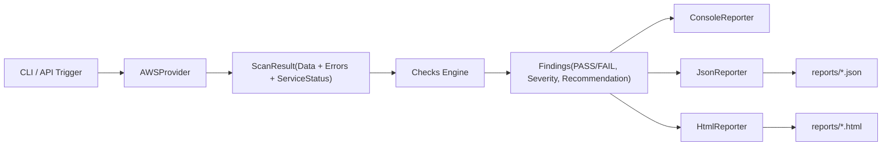

# CloudMisconfig-Scanner

AWS 환경에서 자주 발생하는 보안 오구성을 자동으로 탐지하는 경량 진단 도구입니다.

## 프로젝트 소개
- 문제 정의: 클라우드 운영 중 빈번한 설정 실수(S3 공개, IAM 과권한, SG 노출)를 자동 탐지
- 목표: 보안 오구성 탐지 결과를 위험도와 권고사항까지 포함해 보고서화
- 대상: 단일 계정 MVP 기준의 빠른 진단 워크플로우

## 주요 기능 (MVP)
- S3 버킷 보안 점검
  - 공개 노출(ACL/Policy/Public Access Block)
  - 서버 측 암호화 설정
- IAM 보안 점검
  - 사용자 MFA 미설정
  - 와일드카드 관리자 정책(Action=`*`, Resource=`*`)
- Security Group 보안 점검
  - `0.0.0.0/0`, `::/0` 대상 SSH/RDP/DB 포트 노출
- 리포트 출력
  - 콘솔 요약
  - JSON 저장 (`reports/scan-YYYYMMDD-HHMMSS.json`)
  - HTML 저장 (`reports/scan-YYYYMMDD-HHMMSS.html`)

## 아키텍처


## CLI 실행

### 1) 의존성 설치
```bash
python -m pip install -r requirements.txt
```

### 2) 스캔 실행
```bash
python app/main.py scan --profile default --region ap-northeast-2
```

멀티 프로필 스캔:
```bash
python app/main.py scan-multi --profiles default,prod,dev --region ap-northeast-2
```
또는 파일 입력:
```bash
python app/main.py scan-multi --profiles-file profiles.txt --region ap-northeast-2
```
AssumeRole 멀티 계정 스캔:
```bash
python app/main.py scan-assume-role-multi --targets-file targets.txt --region ap-northeast-2
```
로컬 스케줄링 반복 실행:
```bash
python app/main.py schedule-local --mode scan --profile default --every-minutes 60 --runs 3
```
멀티 프로필 스케줄링:
```bash
python app/main.py schedule-local --mode scan-multi --profiles default,prod --every-minutes 30 --runs 4
```
EventBridge 설정 계획 생성:
```bash
python app/main.py plan-eventbridge --rule-name cloudmisconfig-daily --schedule-expression "rate(1 day)" --target-arn arn:aws:lambda:ap-northeast-2:111111111111:function:cloudmisconfig-runner --invoke-role-arn arn:aws:iam::111111111111:role/EventBridgeInvokeScanner --scan-mode scan --profile default
```
위 명령은 `reports/eventbridge-targets-*.json`을 만들고, `aws events put-rule / put-targets` 적용 커맨드를 출력합니다.
CloudFormation으로 EventBridge 스케줄 배포:
```bash
aws cloudformation deploy --template-file infra/eventbridge-lambda-schedule.yaml --stack-name cloudmisconfig-schedule --parameter-overrides RuleName=cloudmisconfig-daily ScheduleExpression="rate(1 day)" TargetLambdaArn=arn:aws:lambda:ap-northeast-2:111111111111:function:cloudmisconfig-runner
```
CloudFormation으로 EventBridge -> Step Functions 스케줄 배포:
```bash
aws cloudformation deploy --template-file infra/eventbridge-sfn-schedule.yaml --stack-name cloudmisconfig-sfn-schedule --capabilities CAPABILITY_NAMED_IAM --parameter-overrides RuleName=cloudmisconfig-daily-sfn ScheduleExpression="rate(1 day)" StateMachineArn=arn:aws:states:ap-northeast-2:111111111111:stateMachine:cloudmisconfig-runner ScannerProfile=default ScannerRegion=ap-northeast-2
```
Slack 알림 예시:
```bash
python app/main.py scan-multi --profiles default,prod --slack-webhook https://hooks.slack.com/services/xxx
```
이메일 알림 예시:
```bash
python app/main.py scan-multi --profiles default,prod --email-to you@example.com --smtp-host smtp.example.com --smtp-from scanner@example.com --smtp-user user --smtp-password pass
```

또는 기본값으로 실행:
```bash
python app/main.py
```
이력 요약:
```bash
python app/main.py history --limit 20
```

## Web API 실행 (FastAPI)
```bash
uvicorn app.web:app --reload --port 8000
```

엔드포인트:
- `GET /health`
- `GET /scan?profile=default&region=ap-northeast-2`
- `GET /scan-assume-role?role_arn=arn:aws:iam::111111111111:role/SecurityAudit&source_profile=default`
- `GET /scan-multi?profiles=default,prod&region=ap-northeast-2`
- `GET /results?limit=20&cursor=0`
- `GET /trend?limit=20`
- `GET /export/findings.csv`
- `GET /export/history.csv?limit=20`
- `GET /report/{filename}`
- `GET /dashboard`
- `GET /dashboard?only_fail=true&severity=HIGH`

`/results`는 `next_cursor` 기반 pagination을 지원합니다.

## 테스트 실행
```bash
python -m pytest -q
```

## 서비스별 상태 표준화
- 스캔 결과에 `service_status`를 포함합니다.
- 서비스별 상태 값:
  - `SUCCESS`: 해당 서비스 수집 성공
  - `FAILED`: 해당 서비스 수집 실패
  - `PARTIAL`: 일부 성공 + 일부 실패

## 현재 체크 ID
- `AWS.S3.PublicExposure`
- `AWS.S3.EncryptionEnabled`
- `AWS.IAM.UserMFA`
- `AWS.IAM.WildcardPolicy`
- `AWS.IAM.RoleTrustPolicy`
- `AWS.IAM.RoleWildcardPolicy`
- `AWS.EC2.SG.PublicIngress`

## 프로젝트 구조
```text
cloudmisconfig-scanner/
├─ app/
│  ├─ main.py
│  ├─ web.py
│  └─ templates/
│     ├─ report.html.j2
│     └─ dashboard.html.j2
├─ scanner/
│  ├─ core/
│  ├─ providers/aws/
│  ├─ checks/
│  └─ reporting/
├─ docs/
│  ├─ interview-notes.md
│  ├─ pr-summary.md
│  └─ progress-status.md
├─ infra/
│  └─ eventbridge-lambda-schedule.yaml
│  └─ eventbridge-sfn-schedule.yaml
├─ reports/
├─ tests/
├─ .github/workflows/ci.yml
├─ requirements.txt
└─ README.md
```

## 데모 가이드
- 1) `python app/main.py scan --profile default` 실행
- 1-1) `python app/main.py plan --mode today` 또는 `--mode weekly`로 실행 계획 확인
- 2) 생성된 HTML 리포트 열람: `reports/scan-*.html`
- 3) API 대시보드 확인: `http://localhost:8000/dashboard`

## 한계 및 향후 개선
- 현재는 단일 계정/리전 중심 MVP
- 멀티 계정 AssumeRole 스캔 확장 완료
- 알림(Slack/Email) + 로컬 스케줄링 완료
- EventBridge 설정 계획(`plan-eventbridge`) 자동 생성 완료
- EventBridge -> Step Functions 스케줄 IaC 템플릿 완료
- 규칙 수 확대 및 서비스별 권한 부족 상황에 대한 부분 실패 세분화 예정
- 클라우드 네이티브 스케줄링 실제 실행 타겟(Lambda/Step Functions) 연동 고도화 예정

## 진행 단계 요약
- 완료: 1~20단계 (MVP) + 운영 안정화 확장 + 멀티 계정(AssumeRole) + 알림/스케줄링 고도화
- 현재 완성도: 100% (MVP + 고도화 계획 반영)
